# Discover South Wales, Unveiling Nature's Treasures

This website aims to provide information on what stunning landscape to explore within South Wales. This is particularly targeted at new visitors. It is centered around an interactive multiple choice quiz, aimed to tailor the users experiences to match them with their preferences and desires. It aims to be responsive across multiple devices, particularly focusing on mobile first design.

[View Discover South Wales on Github]()

[View the live website here]()

- - -

- [Discover South Wales, Unveiling Nature's Treasures](#discover-south-wales-unveiling-natures-treasures)
  - [User Experience (UX)](#user-experience-ux)
    - [Initial Discussion](#initial-discussion)
      - [Key Information for the site](#key-information-for-the-site)
    - [User Stories](#user-stories)
      - [Client Goals](#client-goals)
      - [First Time Visitor Goals](#first-time-visitor-goals)
      - [Returning Visitor Goals](#returning-visitor-goals)
      - [Frequent Visitor Goals](#frequent-visitor-goals)
  - [Design](#design)
    - [Colour Scheme](#colour-scheme)
    - [Typography](#typography)
    - [Imagery](#imagery)
    - [Wireframes](#wireframes)
    - [Features](#features)
    - [Accessibility](#accessibility)
  - [Technologies Used](#technologies-used)
    - [Languages Used](#languages-used)
    - [Frameworks, Libraries \& Programs Used](#frameworks-libraries--programs-used)
  - [Deployment \& Local Development](#deployment--local-development)
    - [Deployment](#deployment)
    - [Local Development](#local-development)
      - [How to Fork](#how-to-fork)
      - [How to Clone](#how-to-clone)
  - [Testing](#testing)
    - [W3C Validator](#w3c-validator)
    - [Solved Bugs](#solved-bugs)
    - [Testing User Stories](#testing-user-stories)
      - [First Time Visitors](#first-time-visitors)
      - [Returning Visitors](#returning-visitors)
      - [Frequent Visitor Goals](#frequent-visitor-goals-1)
    - [Lighthouse](#lighthouse)
    - [Full Testing](#full-testing)
  - [Credits](#credits)
    - [Code Used](#code-used)
    - [Content](#content)
    - [Media](#media)
    - [Acknowledgement](#acknowledgement)

## User Experience (UX)

### Initial Discussion

Discover South Wales is a website designed for potential first time visitors with limited knowledge of rural areas to explore. It's a simple design, centered round a short quiz, and it aims to give users a quick guide on where to go. By asking a set of 5 questions based on what the user’s preferences are, the website acts as a personal guide, presenting one of eleven locations based on the user's results, that would be well suited to the answers the user gives.

There is an additional Map page, which gives the user an overall view of the suggested locations within South Wales. This also allows the user to explore more options if they are not satisfied with the recommendation from taking the quiz.

#### Key Information for the site

- A user friendly quiz with a set of 5 simple questions with 3 possible answers each, to determine where may be a good place to visit whilst in South Wales.
- An interactive map, allowing the user to select other locations of their choice in the area.
- An external link to an instagram page within the footer, encouraging users to share places they have been and follow the website's instagram page.

### User Stories

#### Client Goals

- To be able to view the site on a range of device sizes.
- To provide a simple start up guide for first time visitors in South Wales, encouraging users to explore suggested locations based on their quiz answers.
- To encourage users to share their stories and connect on the websites' instagram page, with an aim to increase website traffic and encourage tourism in South Wales.

#### First Time Visitor Goals

- I want to visit South Wales for the first time and don't know where to start looking.
- I want to be able to find other places to explore in South Wales if I want more recommendations.
- I want to be able to access additional information on the locations offered.
- I want to be able to navigate through the website with ease and efficiency.

#### Returning Visitor Goals

- I want to be able to share my experiences with other users by following the website's Instagram page.

#### Frequent Visitor Goals

- I want to be able to see other recommendations pop up from time to time, so that I can continue exploring South Wales and share this with others.

- - -

## Design

### Colour Scheme

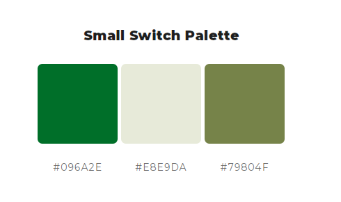

Discover South Wales uses this small switch palette, pulled from [ColorSpace](https://mycolor.space/?hex=%23096A2E&sub=1), and generated from #096A2E, pulled from the logo colour chart below.

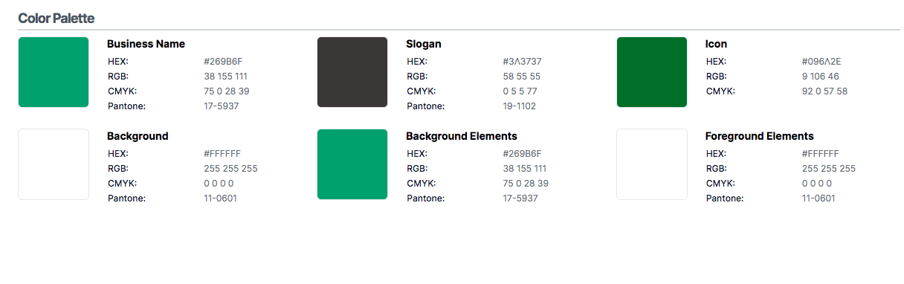

I picked this colour scheme as it went with the colour theme of my customized logo, and has strong connotations to the rural outdoors; keeping in theme with websites function.

### Typography

I used Google Fonts for the following font:

- 'Lato' for all text content across the website. This is a sans serif font.
I picked this particular font as it was suggested on [Figma](https://www.figma.com/google-fonts/josefin-sans-font-pairings/#:~:text=Josefin%20Sans%20is%20an%20elegant>,One%2C%20Lato%2C%20and%20Playfair). The website states that 'Lato' would pair nicely with Josefins sans font, which is the primary font used for the logo on the home page. I wanted to keep it simple and consistent throughout the website, so opted for one style only to portray this.

### Imagery

All digital images in the results section, (excluding two images referenced in the [credit](#media) section), were taken by Clara Reynolds.
The [Seamless Pattern Leaves](assets/images/background-print-image-compressed.webp) for the left and right border across all pages, and the [Hiking Trail Sketch](assets/images/background-hiking.webp) featured in the 404 error page, were both downloaded from [Pixabay](https://pixabay.com/). Content License allows users to use content for free and modify or adapt the content into new works.

### Wireframes

Wireframes were created for mobile, tablet and desktop.

[Home Page - Desktop](docs/wireframes/home/home_page_desktop.png) |
[Home Page - Tablet](docs/wireframes/home/home_tablet.png) |
[Home Page - Mobile](docs/wireframes/home/home_mobile.png)

[Quiz Page (Questions) - Desktop](docs/wireframes/quiz/quiz_questions_desktop_.png) |
[Quiz Page (Questions) - Tablet](docs/wireframes/quiz/quiz_tablet_.png) |
[Quiz Page (Questions) - Mobile](docs/wireframes/quiz/quiz_questions_mobile_.png)

[Quiz Page (Answers) - Desktop](docs/wireframes/quiz/quiz_answers_desktop_.png) |
[Quiz Page (Answers) - Tablet](docs/wireframes/quiz/quiz_answers_tablet_.png) |
[Quiz Page (Answers) - Mobile](docs/wireframes/quiz/quiz_answers_mobile_.png)

[Map Page - Desktop](docs/wireframes/maps/maps_desktop_.png) |
[Map Page - Tablet](docs/wireframes/maps/maps_tablet_.png) |
[Map Page - Mobile](docs/wireframes/maps/maps_mobile_.png)

The final website design has maintained the simple structure as shown in the wireframes, with a few minor changes here and there. I wanted to keep the design quite minimalistic as I wanted to focus more on implementing javascript code to the Quiz and Map page.

### Features

The website consists of three pages, all of which are accessible from the navigation menu throughout the website. A custom 404 error page is also available if a user were to land on it.

*All pages on the website have:*

- A responsive navigation bar and navigation links across the header from left to right as followed - Home, Quiz, Map. On a mobile device, the navigation bar switches to a dropdown menu, taken from [Bootstrap v5.3](https://getbootstrap.com/docs/5.3/components/dropdowns/), so that it is easier to view and navigate on a smaller screen.
- When hovered over, each navigation link will change colour from black to a cream colour (used from the [small switch palette](docs/images/small-switch-palette.png)), to show what page the user is about to navigate to.
- The footer consists of a headline encouraging users to connect with the website's Instagram page, followed by a font awesome icon underneath of the recognisable Instagram logo. When the icon is clicked on, this opens up in a separate browser to www.instgram.com. When hovered over, this link displays the beige colour again, keeping in theme with the small switch palette. There is copyright centered beneath the icon in a small font size.
- Both header and footer contain a natural green/brown colour, pulled from the small switch palette as well.

*Home Page:*

- The home page is a simple and elegant design, featuring a logo that I custom created on [Logo.com](https://logo.com/). The logo image includes a green silhouette of two trees inside a white silhouette of mountain tops, inside a matching green circle. Underneath this a slogan that reads “Discover South Wales” in green, with a tag-line of “Unveiling Nature's Treasures” directly below this. The logo is scaled down to fit mobile devices as well.
- Underneath the logo are two heading titles with the questions “Visiting South Wales for the first time?” and “Ready to start exploring the great outdoors?”. These two headings are short and simple, designed to address the users needs of venturing to the area for the first time.
- Below this I've added a simple div containing a discrete line that splits the page into 2 sections; the heading and quiz information.
The quiz heading instructs  the user to take a short quiz on where to go. This is accompanied with a clear 'Start Quiz' button that navigates the user to the Quiz page. When hovered over the button creates a smooth transition from a green background to a mixture of green and brown, keeping in theme with the colour of the header and footer.

*Quiz Page:*

- When the user navigates to the quiz page they are greeted with the first question with instructions to select one of 3 answers below. When the answers are hovered over by the user the background colour disappears, and when the user selects an answer, it is highlighted in the green/brown mixture, indicating that this has been selected. This was put in place instead of radio buttons, so the user has a greater range to click on, rather than just aiming for a small radio button. A user may click between answers before deciding to move onto the next question. If a user doesn't select an answer and selects the 'next' button, an alert pops up urging the user to select an answer.
- When the next button is hovered over, this too changes to a green/brown colour signifying to the user to click next.
- Over the next set of questions, the initial instructions are removed. At the last question the user is greeted with a submit button, styled in the same way as the next button.
- When the user submits their answers, the quiz questions are replaced all together with one of eleven possible results. These results are structured in the following order:
  - A title featuring “Based on your recommendations, we recommend…”
  - Place name title
  - A brief description of what to expect
  - An accompanying image of the location
  - A link that opens up an external website in a separate window, giving the user more in depth detail about the hike and navigation. When the link is hovered over the background colour changes to white.
- Beneath the results there are two short, but informative headlines. These signify to the user that if they're not happy with their recommended result they can navigate over to the maps page to explore more options. The navigation link is represented by a font awesome icon of a map/marker, which when hovered over changes from green to green/brown.
- This is separated by a line divider, and underneath this there is an option for the user to start the quiz over if they wish to do so. This is represented in the familiar button style marked as 'Start over', keeping in theme with the rest of the website. By clicking this button, the user is taken to the first mutliple choice question again.

*Map Page:*

- The Map page can be accessed via the navigation link Map, or the font awesome map icon when the user receives their recommended results on the quiz page.
- This page features Google Maps, centered on South Wales with eleven markers numbered 1 - 11. Each marker, when clicked on once will display the name of the marker's location. When double clicked, this also takes the user to an external website in a separate window, with more details on the location. The user is able to zoom in and out, and move around the maps, to explore each marker available.
- If, due to poor internet connection, the maps are loading slowly, I've implemented simple loading dots just below the navigation bar, to indicate to the user that the maps are loading.
- Above the Google Maps are simple instructions, represented with an 'information' font awesome icon ('i'), telling the user to “Click the map markers to view place names, and double click them for more information”. This gives the user clarity on how to navigate through Google Maps.

*404 Error Page:*

- The 404 page Features a print of a figure walking through the hills with a couple of trees. This image is sandwiched between two informative headings reassuring the user that they can navigate back to the home page (featured at the bottom), to continue using the website.

*Future Implementations:*

- Future goals include creating an Instagram page that allows users to share images of where they have been, tagging @DiscoverSouthWales or #DiscoverSouthWales, for a chance to get their photo featured on the official Instagram page. This will encourage new users to stumble across the Instagram page, in turn leading them to this website to participate in the quiz.
- I want to add more place results, and potentially replace old ones, so that returning users can continue exploring other places to go.
- I want to be able to extend the quiz, asking further questions, so that the user gets an even more specified result, tailoring to their outdoor wants and desires.

### Accessibility

I have ensure that this website is as accessible friendly as possible, I have done the following to achieve this:

- Used semantic HTML.
- Used visually hidden text to describe background images in CSS, where an alt attribute cannot be supplied.
- Included aria-label for website navigation to describe to the screen reader where the user is being taken to.
- Used alt attributes to images in HTML to describe them.
- Using the [WebAIM](https://webaim.org/resources/contrastchecker/) colour contrast checker to ensure all body text is legible with sufficient contrast.

- - -

## Technologies Used

### Languages Used

HTML, CSS and Javascript were used to create this website.

### Frameworks, Libraries & Programs Used

- Pencil - Used to create wireframes.

- Git - For version control.

- Github - To save and store the files for the website.

- Logo.com - Used to design and create a logo

- Pixabay.com - used to download image artwork for website

- [My Color Space](https://mycolor.space/) - To choose the colours used for the website.

- [Font Awesome](https://fontawesome.com/) - For the iconography on the website.

- [Google Fonts](https://fonts.google.com/) - To import and use the fonts from the website.

- [Flexbox Library](https://css-tricks.com/snippets/css/a-guide-to-flexbox/#aa-flexbox-tricks) - Used as a prompt and guidance for website structure and display.

- [Contrast Checker](https://webaim.org/resources/contrastchecker/) - Ran tests on all text against background colour to ensure contrast checker past.

- [Bootstrap](https://getbootstrap.com/docs/5.3/getting-started/introduction/) - Used for inserting a dropdown menu in mobile responsive design.

- [BIRME](https://www.birme.net/) - To convert images from jpeg to webp images to improve lighthouse performance.

- [TinyPNG](https://tinypng.com/) - To compress large image files on website.

- [Am I Responsive](https://ui.dev/amiresponsive?url=https://clarar93.github.io/paddle-adventures/index.html) - To show the website on a range of devices.

- Google Dev Tools - To troubleshoot and test various features, and solve issues with responsiveness and styling.

- [Color Hex](https://www.color-hex.com/color/79804f) to find a lighter colour tint for the header and footer to pass the contrast checker.

## Deployment & Local Development

### Deployment

Github Pages was used to deploy the live website. The instructions are as followed:

1. Log in (sign up) to Github.
2. Search for this repository, Discover-South-Wales.
3. Navigate to the settings tab.
4. On the left hand menu click on the pages link.
5. In the source section, select main from the drop down menu under Branch.
6. Select root from the drop down folder and click save.
7. Your live Github pages site is now deployed at the following: [ClaraR93]()

### Local Development

#### How to Fork

To fork the paddle-adventures repository:

1. Go to the GitHub repository.
2. Click on Fork button in the upper right-hand corner.

#### How to Clone

To clone the Discover-South-Wales repository:

1. Log in (sign up) to Github.
2. Search for this repository, Discover-South-Wales.
3. Select the code button and choose whether you would like to clone with HTTPS, SSH or GitHub CLI and copy the link shown to your clipboard.
4. Open the terminal in your code editor and change the current working directory to the location you want to use for the cloned directory.
5. Type 'git clone' into the terminal and then paste the link you copied. Select enter.

- - -

## Testing

Testing was implemented throughout the entire build of this project. I used Chrome Developer tools to identify and troubleshoot problems along the way.

*The following issues were identified during my mid mentor meeting:*

*The following suggestions were recommended when I showed a friend the site for review:*

- Tom Roberts informed me that once a user lands on the submit page, the following text should be a more obvious button that takes the user to the maps page, rather than just a small map icon. See image: 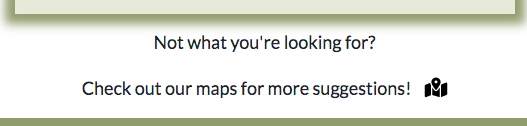
- Tom also suggested that this page should include an additional button which gives the user the option to navigate back to the home page to restart the quiz if they want to. Final result with peer review implemented:
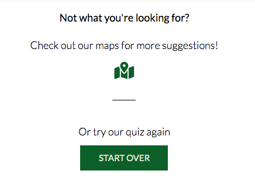

*The following suggestions were recommended when I submitted my site to peer code review on slack:*

### W3C Validator

### Solved Bugs

**Logic of interactive quiz:**

- When drafting up the quiz logic prior to coding, I  assigned each multiple choice answer to one of 11 possible results at the end for the user. This resulted in a very unique set of answers tailored to each result, which would restrict the quiz; given that a user would have to match their answers perfectly to a specific result. This would limit the user experience as it would be likely that based on their input, they wouldn't always get an exact match.
- Instead I opted for a simpler quiz logic where I graded each multiple choice answer from 1-3. With 5 questions and 3 answers for each, these points would generate any number between 5 and 15. Based on this, I assigned each number to one of 11 results tailored to the user's input.
As a result, it was easier to visualise how I would create a function that would calculate the score, i.e: By taking the final sum of the user's 5 answers, and returning a given result.

*Draft plan of function before implemented in code:*

- 5 questions | 3 answers | Value assigned to each answer:
  - Answer A = 1 point
  - Answer B = 2 points
  - Answer C = 3 points

User score | Assigned Result
---|---
5 | 1
6 | 2
7 | 3
8 | 4
9 | 5
10 | 6
11 | 7
12 | 8
13 | 9
14 | 10
15 | 11

**Radio Input buttons:**

- When testing the radio buttons for the multiple choice questions, the user was able to select all three buttons, which was not my expected result. I did some research on [Stack Overflow](https://stackoverflow.com/questions/5419459/how-to-allow-only-one-radio-button-to-be-checked), and found that I had given individual names to each input, when I should have grouped these under one name. After amending this the radio buttons worked as intended, allowing one selection at a time.

**Radio Input Checked:**

- I wanted to get the radio button element from the html file in its checked state to create an if else statement, ensuring a user is prompted to click on the radio button if they hit next without selecting anything. [Stack overflow](https://stackoverflow.com/questions/1423777/how-can-i-check-whether-a-radio-button-is-selected-with-javascript) helped me here, as I wasn’t sure how to select a radio input that had been checked. 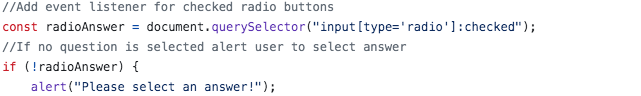

**Clear radio function - part 1:**

- I noticed when I ran through the quiz the radio button always remained checked on the last users input. I wanted to ensure the radio buttons were cleared every time a user started a new question. I used code from [Tutorial Point](https://www.tutorialspoint.com/how-to-uncheck-a-radio-button-using-javascript-jquery#:~:text=In%20the%20clearRadio()%20function,to%20uncheck%20the%20radio%20button) to assist me with this.
- Within this code I made sure to assign the checked radio button with a false boolean, which would be called as an event listener after the user hits the next button.

**Clear radio button function - Part 2**

- After creating the clearRadio function to ensure the radio button was deselected for the next question in the quiz, I encountered a problem where the function wasn’t working, despite using code from Tutorials Point as stated in the last problem.
- I realized that this was because I wasn’t iterating through each question so that the radio buttons were always unchecked, so I used the forEach method to iterate through each question, ensuring that the radio buttons were always unchecked to start off with. 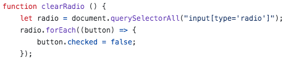

**Problem with logging multiple array answers:**

- I ran a test anticipating what would happen if a user changed their mind and selected a diff radio button before moving onto the next question. Unfortunately this resulted in all user selections being pushed into an empty userAnswers array. This would result in more values being pushed into the array, which would lead to incorrect or non-existent results at the end of the quiz.
- I resolved this by adding an event listener for the next and submit button, to restrict users' selections to only being logged once they clicked these buttons. I did this by calling the validateUserInput function in the event listener when clicked, which would then call the storeUserAnswers function, logging the user input into the userAnswers array.
- See image of final console log below- including a calculateScore function implemented at the end with a total sum of the userAnswers array.
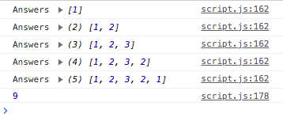

**Quiz flow error before submission:**

- When testing what would happen if a user didn’t click the submit button and the alert was flagged up, I noticed that once the user clicked off the alert the code below would be triggered anyway and the user would be presented with the results display before they even had a chance to select the final radio button.

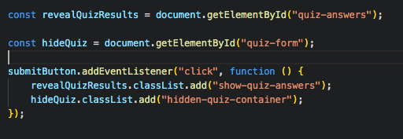

- To rectify this, I encompassed the previous code in an if statement so that the classList.add events were only triggered once a user selected their final radio button.

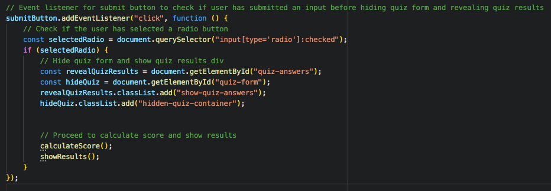

- To tidy this code up further, I created a separate function called hideQuiz and called this within an event listener when a user clicks on the submit button. See final code of hideQuiz function:

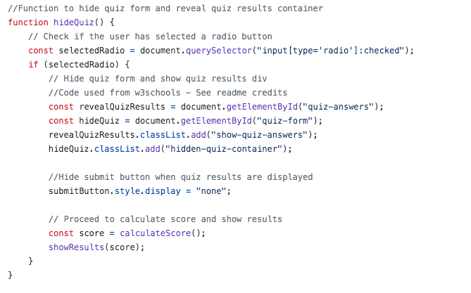

**Replacing if else statement with math.min/math.max method:**

- When drafting up the logic for how the quiz results would be generated, I initially decided to go with an if else statement, whereby if the final results were equal to 5 this would produce the first answer, else if they were equal to 6 it would produce the second answer, and so on.
- I found that this would result in a very lengthy if else statement and wanted to come up with something simpler and cleaner. I started by googling how to convert a range of numbers, as I had a set of 11 answers ranging from a score point of 5 to 15. I wanted to convert these points to an index from 0 through to 10, making it easier to iterate through the object answers array and assign their given calculated score.
- For this I used [Stack Overflow](https://stackoverflow.com/questions/5842747/how-can-i-use-javascript-to-limit-a-number-between-a-min-max-value), which suggested using the math.min and math.max method in javascript to achieve this. I passed the score in, making sure to take away 5, creating the minimum index of 0 and setting the maximum number to 10. This would give me 11 indexes which I could assign to the 11 possible results generated. 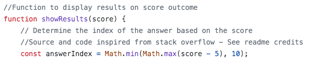

**Misplacement of alt image display:**

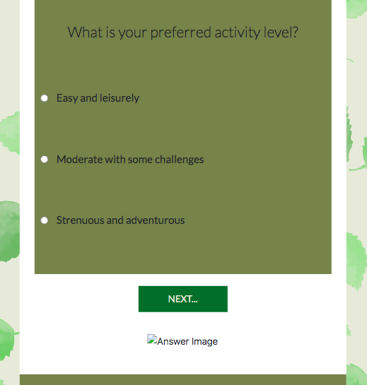

- In the image above, the icon with the placeholder alt tag was showing below the next button during the quiz, even though the quiz answers title and description were displayed once the showResults function was called. I quickly fixed this by setting the answer-image div display to none initially, and setting it back to block within the showResults function.

**Clicking on map markers in mobile responsive design:**

- Originally, when a user was to hover over a map marker, the place name would pop up, and when clicked on, the user would navigate to a separate web page with additional information. I tested this on my mobile phone too, and noticed that a user was unable to hover over the map markers to view the info window displaying the place name. Instead, they were limited to clicking on any one of the markers leading them to an external website.
- This would result in a poor user experience as the user wouldn’t know which marker they were clicking on without the aid of an information window, before deciding to open up a new tab.
- To ensure this was compatible on mobile devices as well, I altered the event listeners by having a user click on a marker to view their name, and then double click on this to view an external tab with more information. Additionally, I placed some brief instructions above the map, to make it clear on how to navigate through this. See image below:

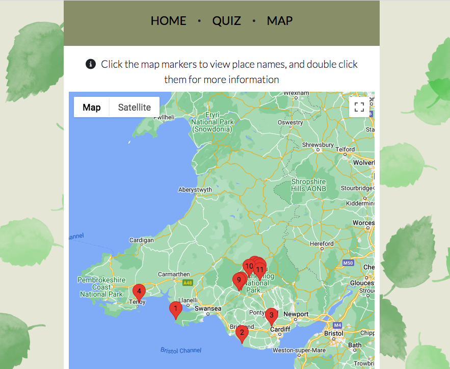

**Quiz container style:**

- I wasn’t happy with the div container boxes storing the quiz questions and answer results, and wanted to style these differently.
  
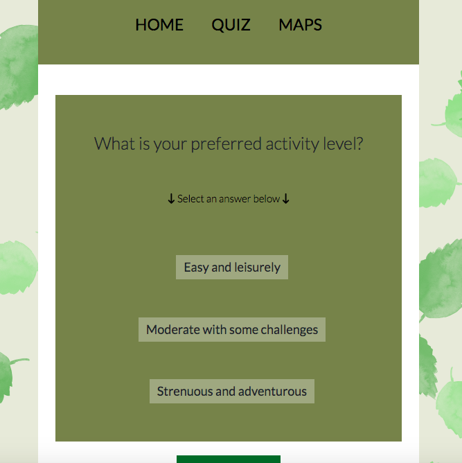

- The original design above felt too garish, almost stealing the spotlight from the quiz content.
I considered using a box shadow effect instead, and used [Design Shack](https://designshack.net/articles/css/inner-shadows-in-css-images-text-and-beyond/) to assist me with its placement. The results achieved were far more stylish and elegant, and gracefully complemented the foreground quiz content.

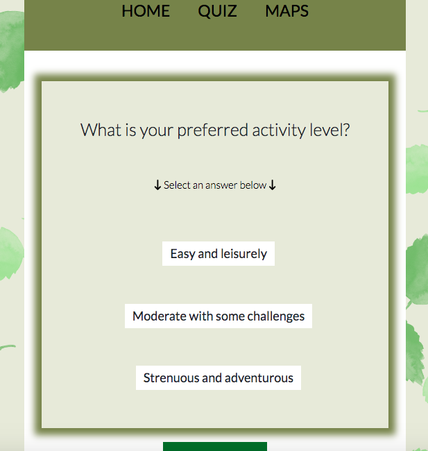

**Contrast fail:**

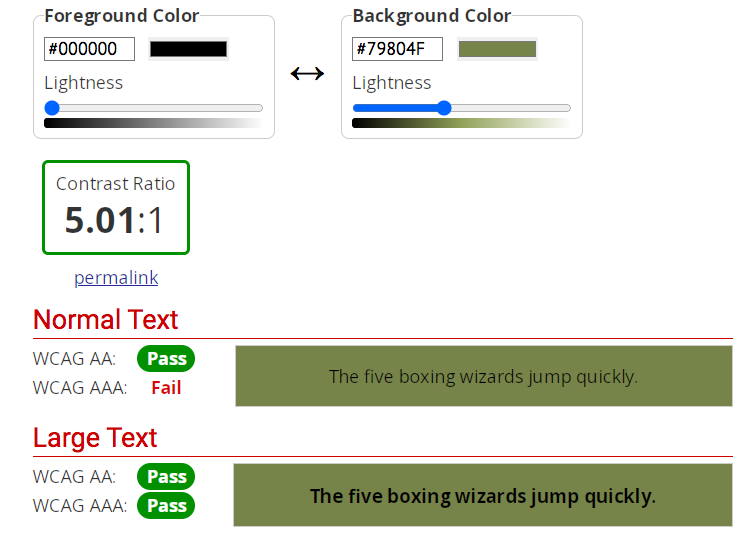

- The contrast in header and footer wasn’t strong enough for lighter weight font, so I tried changing the font colours to something lighter, such as beige or white to match with a consistent colour theme. Unfortunately this didn’t pass the contrast checker either, so I went on [color-hex](https://www.color-hex.com/color/79804f) and found a lighter tint of the original background colour and replaced it with [#939972](https://www.color-hex.com/color/939972).
- This passed the contrast checker test, also meaning I could keep in theme with the colour palette, only dropping a couple of tint’s lighter for better legibility.
  
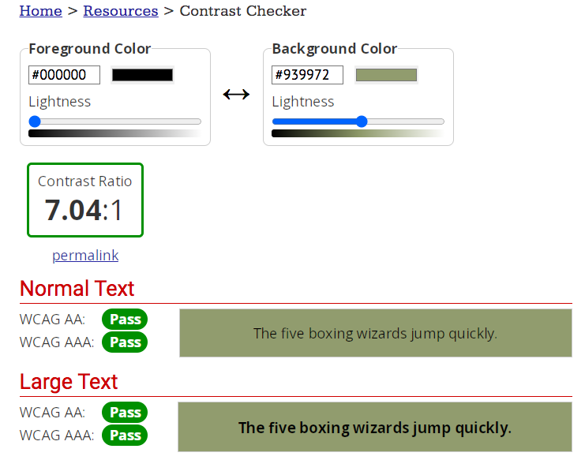

**Quiz answer layout:**

- In my original wireframe design as shown below, I included a location pin of the tailored result.

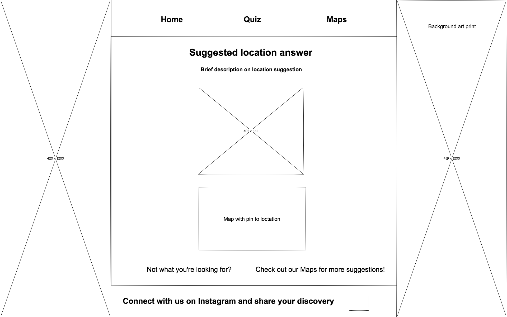

- I decided not to include this in my final design as it would have appeared too cluttered, and given that there was already a page for maps, with a direct link below the results, I didn’t see the need to include both. See final design below:
  
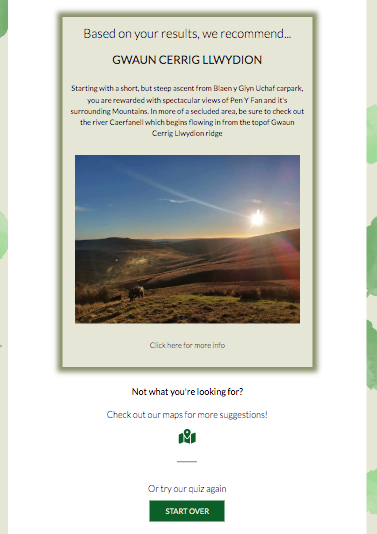

### Testing User Stories

#### First Time Visitors

#### Returning Visitors

#### Frequent Visitor Goals

### Lighthouse

### Full Testing

- - -

## Credits

### Code Used

- [Bootstrap 5.3](https://getbootstrap.com/docs/5.3/components/dropdowns/) - Code used to implement a dropdown menu bar when viewed on a mobile device.
  
- [Tutorials Point](https://www.tutorialspoint.com/how-to-uncheck-a-radio-button-using-javascript-jquery#:~:text=In%20the%20clearRadio()%20function,to%20uncheck%20the%20radio%20button.) - Code used when researching how to uncheck a radio button when the user arrives at a new question within the quiz.

- [FreeCodeCamp](https://www.freecodecamp.org/news/how-to-add-numbers-in-javascript-arrays/ ) - Code used to add and get the total sum of the numbers in userAnswer array.

- [W3schools HTML DOM Element classList](https://www.w3schools.com/jsref/prop_element_classlist.asp) - Code used to hide quiz questions div and display quiz answers div.

- [Stack Overflow, min/max value](https://stackoverflow.com/questions/5842747/how-can-i-use-javascript-to-limit-a-number-between-a-min-max-value) - Code logic applied to quiz scores, I converted the range of 5 to 15 to an index from 0 - 10 for easier accessibility.

- [Google maps API documentation](https://developers.google.com/maps/documentation/javascript/markers
) - Code used for importing map and markers.

- [Stack Overflow, window.open method](https://stackoverflow.com/questions/4373212/open-google-map-in-new-window) - Code used for window.open method, applied to google maps API.

- [Stack Overflow, replace radio buttons and style](https://stackoverflow.com/questions/4641752/css-how-to-style-a-selected-radio-buttons-label) - Used code to remove radio buttons and replace with stylised highlighted questions which a user can select and submit instead.

- [Stack Overflow, Loading dots](https://stackoverflow.com/questions/4639716/dot-dotdot-dotdotdot-as-loading
) - Used code to create and customise loading dots before google maps api loads.

- [Design Shack](https://designshack.net/articles/css/inner-shadows-in-css-images-text-and-beyond/) - Used code to assist with correct box shadow placement.

- [Accessiblity Developer Guide](https://www.accessibility-developer-guide.com/knowledge/aria/bad-practices/) - Used visually hidden code to replace aria-label. I used this code in my first milestone project, which proved effective for the background images in style.css

### Content

### Media

Special thanks to:

- [Yulie1](https://pixabay.com/users/yulie1-2071715/) for allowing me to download and use the *Seamless Pattern Leaves* image.

- [StarGladeVintage](https://pixabay.com/users/stargladevintage-17411787/) for allowing me to download and use the *Hiking Trail Sketch* image.

- Nathan Coogan for giving me permission to use the [waterfall](assets/images/results/sgwd-ddwli-uchaf-waterfall.webp) and [hike](assets/images/results/pen-y-fan.webp) photo for the results section.

### Acknowledgement
