# Testing

- [Testing](#testing)
  - [Code Validation](#code-validation)
    - [W3C Validator](#w3c-validator)
    - [JSLint](#jslint)
  - [Browswer compatibility](#browswer-compatibility)
  - [Issues resolved during development](#issues-resolved-during-development)
  - [Unresolved issues](#unresolved-issues)
  - [Mentor and Peer Feedback](#mentor-and-peer-feedback)
  - [Testing User Stories](#testing-user-stories)
    - [First Time Visitors](#first-time-visitors)
    - [Returning Visitors](#returning-visitors)
    - [Frequent Visitor Goals](#frequent-visitor-goals)
  - [Lighthouse](#lighthouse)
  - [Full manual testing](#full-manual-testing)

Testing was implemented throughout the entire build of this project. I used Chrome Developer tools to identify and troubleshoot problems along the way.

## Code Validation

### W3C Validator

I used W3C HTML Validator on all pages created, and W3C CSS Validator on CSS content to make sure there were no errors found. 

- [index.html](docs/w3c/w3c-html-validator-home.png)
- [quiz.html](docs/w3c/w3c-html-validator-quiz.png)
- [maps.html](docs/w3c/w3c-html-validator-maps.png)
- [404.html](docs/w3c/w3c-html-validator-404.png)
- [style.css](docs/w3c/s3c-css-validator-results.png)

### JSLint

I used JSLint on all javascript content. No errors reported on final javascript files.

*quiz.js:*

*maps.js:*

## Browswer compatibility

I have tested the site on various desktop browsers and mobile devices ensuring the website is fully functional with no issues. The following devices worked with no errors on any pages:

**Desktop:**

- Google Chrome
- Mozilla Firefox
- Microsoft Edge

**Mobile:**

- Samsung Galaxy A52
- Iphone 13 mini
- Google Pixel 6

## Issues resolved during development

**Logic of interactive quiz:**

- When drafting up the quiz logic prior to coding, I  assigned each multiple choice answer to one of 11 possible results at the end for the user. This resulted in a very unique set of answers tailored to each result, which would restrict the quiz; given that a user would have to match their answers perfectly to a specific result. This would limit the user experience as it would be likely that based on their input, they wouldn't always get an exact match.
- Instead I opted for a simpler quiz logic where I graded each multiple choice answer from 1-3. With 5 questions and 3 answers for each, these points would generate any number between 5 and 15. Based on this, I assigned each number to one of 11 results tailored to the user's input.
As a result, it was easier to visualise how I would create a function that would calculate the score, i.e: By taking the final sum of the user's 5 answers, and returning a given result.

*Draft plan of function before implemented in code:*

- 5 questions | 3 answers | Value assigned to each answer:
  - Answer A = 1 point
  - Answer B = 2 points
  - Answer C = 3 points

Possible user score | Assigned Result
---|---
5 | 1
6 | 2
7 | 3
8 | 4
9 | 5
10 | 6
11 | 7
12 | 8
13 | 9
14 | 10
15 | 11

**Radio Input buttons:**

- When testing the radio buttons for the multiple choice questions, the user was able to select all three buttons, which was not my expected result. I did some research on [Stack Overflow](https://stackoverflow.com/questions/5419459/how-to-allow-only-one-radio-button-to-be-checked), and found that I had given individual names to each input, when I should have grouped these under one name. After amending this the radio buttons worked as intended, allowing one selection at a time.

**Radio Input Checked:**

- I wanted to get the radio button element from the html file in its checked state to create an if else statement, ensuring a user is prompted to click on the radio button if they hit next without selecting anything. [Stack overflow](https://stackoverflow.com/questions/1423777/how-can-i-check-whether-a-radio-button-is-selected-with-javascript) helped me here, as I wasn’t sure how to select a radio input that had been checked.

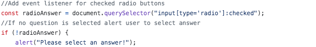

**Clear radio function - part 1:**

- I noticed when I ran through the quiz the radio button always remained checked on the last users input. I wanted to ensure the radio buttons were cleared every time a user started a new question. I used code from [Tutorial Point](https://www.tutorialspoint.com/how-to-uncheck-a-radio-button-using-javascript-jquery#:~:text=In%20the%20clearRadio()%20function,to%20uncheck%20the%20radio%20button) to assist me with this.
- Within this code I made sure to assign the checked radio button with a false boolean, which would be called as an event listener after the user hits the next button.

**Clear radio button function - Part 2:**

- After creating the clearRadio function to ensure the radio button was deselected for the next question in the quiz, I encountered a problem where the function wasn't working, despite using code from Tutorials Point as stated in the last problem.
- I realized that this was because I wasn't iterating through each question so that the radio buttons were always unchecked, so I used the forEach method to iterate through each question, ensuring that the radio buttons were always unchecked to start off with.

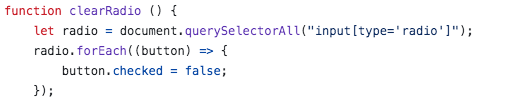

**Problem with logging multiple array answers:**

- I ran a test anticipating what would happen if a user changed their mind and selected a diff radio button before moving onto the next question. Unfortunately this resulted in all user selections being pushed into an empty userAnswers array. This would result in more values being pushed into the array, which would lead to incorrect or non-existent results at the end of the quiz.
- I resolved this by adding an event listener for the next and submit button, to restrict users' selections to only being logged once they clicked these buttons. I did this by calling the validateUserInput function in the event listener when clicked, which would then call the storeUserAnswers function, logging the user input into the userAnswers array.
- See image of final console log below- including a calculateScore function implemented at the end with a total sum of the userAnswers array.

**Quiz flow error before submission:**

- When testing what would happen if a user didn't click the submit button and the alert was flagged up, I noticed that once the user clicked off the alert the code below would be triggered anyway and the user would be presented with the results display before they even had a chance to select the final radio button.

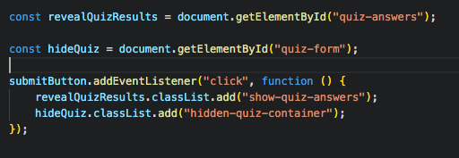

- To rectify this, I encompassed the previous code in an if statement so that the classList.add events were only triggered once a user selected their final radio button.

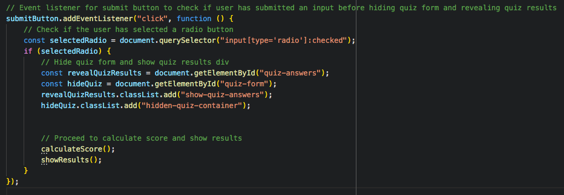

- To tidy this code up further, I created a separate function called hideQuiz and called this within an event listener when a user clicks on the submit button. See final code of hideQuiz function:

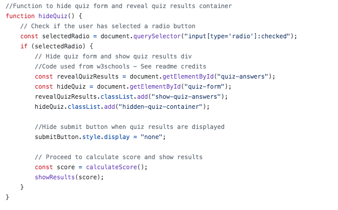

**Replacing if else statement with math.min/math.max method:**

- When drafting up the logic for how the quiz results would be generated, I initially decided to go with an if else statement, whereby if the final results were equal to 5 this would produce the first answer, else if they were equal to 6 it would produce the second answer, and so on.
- I found that this would result in a very lengthy if else statement and wanted to come up with something simpler and cleaner. I started by googling how to convert a range of numbers, as I had a set of 11 answers ranging from a score point of 5 to 15. I wanted to convert these points to an index from 0 through to 10, making it easier to iterate through the object answers array and assign their given calculated score.
- For this I used [Stack Overflow](https://stackoverflow.com/questions/5842747/how-can-i-use-javascript-to-limit-a-number-between-a-min-max-value), which suggested using the math.min and math.max method in javascript to achieve this. I passed the score in, making sure to take away 5, creating the minimum index of 0 and setting the maximum number to 10. This would give me 11 indexes which I could assign to the 11 possible results generated.

**Misplacement of alt image display:**

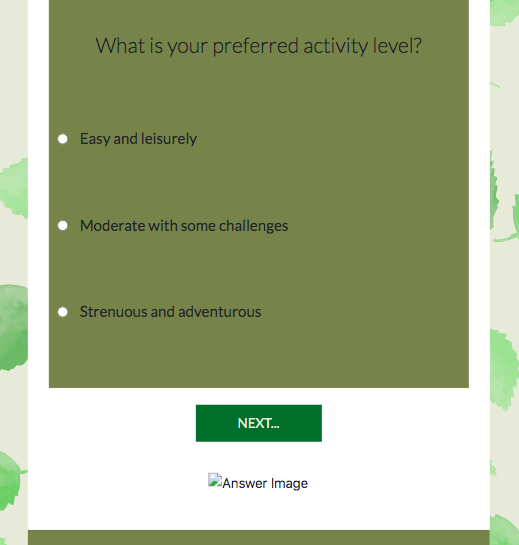

- In the image above, the icon with the placeholder alt tag was showing below the next button during the quiz, even though the quiz answers title and description were displayed once the showResults function was called. I quickly fixed this by setting the answer-image div display to none initially, and setting it back to block within the showResults function.

**Clicking on map markers in mobile responsive design:**

- Originally, when a user was to hover over a map marker, the place name would pop up, and when clicked on, the user would navigate to a separate web page with additional information. I tested this on my mobile phone too, and noticed that a user was unable to hover over the map markers to view the info window displaying the place name. Instead, they were limited to clicking on any one of the markers leading them to an external website.
- This would result in a poor user experience as the user wouldn't know which marker they were clicking on without the aid of an information window, before deciding to open up a new tab.
- To ensure this was compatible on mobile devices as well, I altered the event listeners by having a user click on a marker to view their name, and then double click on this to view an external tab with more information. Additionally, I placed some brief instructions above the map, to make it clear on how to navigate through this. See image below:

**Quiz container style:**

- I wasn't happy with the div container boxes storing the quiz questions and answer results, and wanted to style these differently.
  

- The original design above felt too garish, almost stealing the spotlight from the quiz content.
I considered using a box shadow effect instead, and used [Design Shack](https://designshack.net/articles/css/inner-shadows-in-css-images-text-and-beyond/) to assist me with its placement. The results achieved were far more stylish and elegant, and gracefully complemented the foreground quiz content.

**Contrast fail:**

- In the above image, the contrast in header and footer wasn't strong enough for lighter weight font, so I tried changing the font colours to something lighter, such as beige or white to match with a consistent colour theme. Unfortunately this didn't pass the contrast checker either, so I went on [color-hex](https://www.color-hex.com/color/79804f) and found a lighter tint of the original background colour and replaced it with [#939972](https://www.color-hex.com/color/939972).
- This passed the contrast checker test, also meaning I could keep in theme with the colour palette, only dropping a couple of tint's lighter for better legibility. See passed contrast checker below:
  
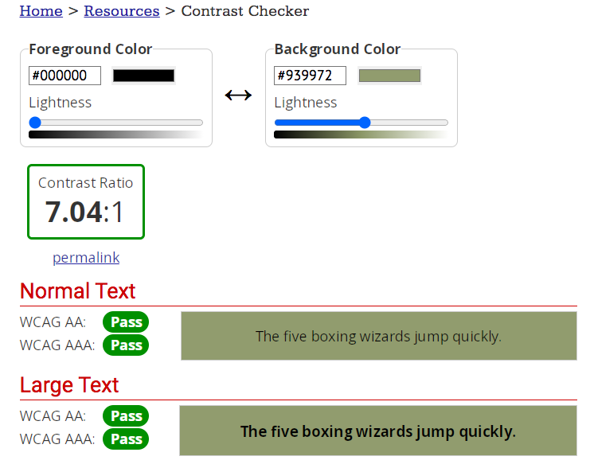

**Quiz answer layout:**

- In my original wireframe design as shown below, I included a location pin of the tailored result.

- I decided not to include this in my final design as it would have appeared too cluttered, and given that there was already a page for maps, with a direct link below the results, I didn't see the need to include both. See final design below:
  

**W3C HTML Validator issues:**

- I came across the following issues when running the quiz.html code through it:

- I researched this issue and came across [Stack Overflow's](https://stackoverflow.com/questions/30658663/bad-value-for-attribute-src-on-element-img-must-be-non-empty-for-dynamically) suggested solution of setting the image src attribute to '#' as a temporary placeholder, before being filled with the result image at the end of the quiz. This seemed to work, and cleared the error all together.

- A similar issue cropped up regarding some of the empty heading content:

- I tackled this issue again by placing '#' as placeholders. However this caused them to appear beneath the quiz questions. I ammended this as well by targeting their ID's in style.css, and setting their display to none. I then set their display to block within the showResults function, to ensure these are displayed once the quiz results are displayed.

**initMap is not a function error:**

- The following issue was being logged to the console on the Map page:
  

- After researching the initMap is not a function error, I cam across [Yahya Elharony's](https://elharony.com/initmap-is-not-a-function/) article on solving this issue. I atttempted the second suggested fix; moving the map script to the bottom of the html page, after maps.js script. This resolved the issue, removing the console error.

**JSLint Warnings:**

- When I ran both quiz.js and map.js through the JSLint validator, a few issues arose which I did my best to rectify. Some examples below:

*quiz.js:*

Warning | Details | Fix
---|---|---
Line is longer than 80 characters. | As I had a lot of information contained within object arrays, I decided to opt into allowing longer than 80 charcters, as this would be very restrictive for my code. | In [JSLint](https://www.jslint.com/), within the optional directives I added /*jslint long*/ to allow long lines.
Undeclared 'document.' | This issue was flagging up whenever I was accessing the document. | I Used the optional directives to fix this again, by adding /*jslint browser*/ so that JSLint would assume browser environment.
Unexpected '++' | This issue was flagging up on line 123 containing 'currentQuestionIndex ++;' | I did some research on [JSLint Error Explanations](http://linterrors.com/js/unexpected-plus-plus), and found that although this used the correct syntax, JSLint threw this error as a violation of specific coding style. A quick fix was to use the normal addition operator instead.

*maps.js:*

Warning | Details | Fix
---|---|---
JS lint was unable to finish | expected '{' and instead saw 'wait' on line 25 | I made sure to put curly brackets for all 'if else' statements within the function, resoliving the issue.
Use regular function instead of arrow function | Prompted me to change this as suggested function was too complex for the use of an arrow function | Followed instructions as told
JSLint undeclared 'google' | See [image](docs/images/undeclared-google.png) for further details | I embedded the global directive to specify google as a global variable, as the google API script is within maps.html and not included in maps.js.

**'Google is not defined' in maps:**

When making the final checks on my website, I noticed that the following error was showing up, when it had previously not:

I did some research on [Stack overflow](https://stackoverflow.com/questions/14229695/google-maps-api-throws-uncaught-referenceerror-google-is-not-defined-only-whe), and Sohan Jangid's comment, *'Uncaught ReferenceError: google is not defined error will be gone when removed the async defer from the map API script tag'*, helped with this issue, as I simply removed async from the script tag in maps.html.

## Unresolved issues

**Console log warning:**

- Once my site was live on github, the warning below was showing on all pages:
  
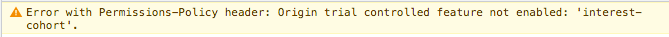

- After looking at [Stack overflow](https://stackoverflow.com/questions/69619035/error-with-permissions-policy-header-unrecognized-feature-interest-cohort) for guidance, I attempted adding a 'permission policy' meta tag to resolve the issue, however this didn't work. The warning wasn't causing the website to malfunction and everything was working fine. I will revisit this issue at a later date.

- I noticed an issue, as shown in the image below, that highlighted audit usage of navigator.userAgent, navigator.appVersion, and navigator.platform, within Google maps javascript code. 

- I researched how to rectify this, and found that [Stack Overflow](https://stackoverflow.com/questions/68982181/issue-audit-usage-of-navigator-useragent-navigator-appversion-and-navigator-p) suggested a few things, inclding to wait for the authors of the library to fix the issue and update it, or disable the extension all together. [Google Chrome Help](https://support.google.com/chrome/thread/137261347/audit-usage-of-navigator-useragent-navigator-appversion-and-navigator-platform?hl=en) also pointed out that the web app should continue to work normally, since this message is not actually an error, but a warning message to make developers aware that talls to those API's will no longer return accurate information in the future.

## Mentor and Peer Feedback

*The following issues were identified during my mid mentor meeting:*

- During my mid mentor meeting, I addressed a console log issue with my mentor, Sheryl Goldberg, who was kind enough to go through the problem with me and come up with a solution. See initial problem below:
  

- She suggested that I pass an event parameter through the validateUserInput function and nest an additional if statement within the primary else statement. Within this if statement I used the event.target method to target both the next and submit button separately. This would ensure that once a user clicks on the submit button, the askQuestions function is no longer called, as it is no longer required. This eliminated the original console log error and rectified the issue. See updated function below:

  
- Sheryl also informed me to ensure that I pass the event parameter within my event listener in the runQuiz function, using [Plain English](https://plainenglish.io/blog/passing-arguments-to-event-listeners-in-javascript-1a81bc397ecb) as guidance. I also removed the submit button event listener that called the hideQuiz function, as this was already being called within the validateUserInput function.

- Sheryl also pointed out that my 'next' button in the quiz section could only be seen on her monitor when she scrolled down a little. This could be confusing for users as it may not be so obvious on what to do next once an answer is selected.

- To rectify this, I added further instructions below the initial quiz question, direting the user to select an answer, then click the next button to move on.

- My mentor finally suggested changing the syntax for block commented code within my script file. She suggested encompassing multiline code with '/**/' as instructed in [Digital Ocean](https://www.digitalocean.com/community/tutorials/how-to-write-comments-in-javascript), on how to write comments in javascript.

*The following suggestions were recommended when I showed a friend the site for review:*

- Tom Roberts informed me that once a user lands on the submit page, the following text should be a more obvious button that takes the user to the maps page, rather than just a small map icon. See image: 
- Tom also suggested that this page should include an additional button which gives the user the option to navigate back to the home page to restart the quiz if they want to. Final result with peer review implemented:

*The following suggestions were recommended when I submitted my site to peer code review on slack:*

- Allen Gleeson suggested changing the font weight of the content below the quiz results as it was coming up a little thin on his side. I changed the weight of the 'Lato' font from 300 to 400 to resolve this.
- Allen also suggested putting all sections within all html files within a main html structure to keep consistency with the header and footer.

## Testing User Stories

### First Time Visitors

*I want to visit South Wales for the first time and don't know where to start looking.*

- Discover South Wales provides an easily accessible website that addresses the users wants directly on the home page. The headings are clear and to the point, asking the user directly if they are visiting for the first time and if they are ready to start exploring. The quiz button and tagline are obvious enough to the user to take part in to help them find a suited location.

*I want to be able to find other places to explore in South Wales if I want more recommendations.*

- The website offers a Map page which gives the user access to Google Maps with 11 markers of all possible results generated from the quiz. The markers provide the name of the location, and access to an external page if the user wants to find out more.

*I want to be able to access additional information on the locations offered.*

- As well as having map markers that when clicked on, navigate the user to an external information page, the user can access these after taking the quiz and getting a suggestion result.
  

*I want to be able to navigate through the website with ease and efficiency.*

- On desktop and tablet, the navigation links are displayed clearly, separated by two dots. Each page has direct instructions, prompting the user to access certain information. Each button has a matching style element, with clear and concise instructions within. Font awesome icons are used where appropriate and are familiar to a user on what they do.

### Returning Visitors

*I want to be able to share my experiences with other users by following the website's Instagram page.*

- Across all pages, the footer displays an instagram icon, with accompanying text telling the user to connect and share.

### Frequent Visitor Goals

*I want to be able to see other recommendations pop up from time to time, so that I can continue exploring South Wales and share this with others.*

- As mentioned in future implementations, I want to be able to create a working instagram page which encourages users to share images of where they have been and tagging Discover Wales' within.
- The Map page will host additional markers with other places to go, potentially replacing some old ones that pop up the least when users take the quiz.

## Lighthouse

I used Lighthouse in Chrome Developer tools so I could test the performance, accessibility, best practices and SEO of the website.

**Home Page - Desktop:**

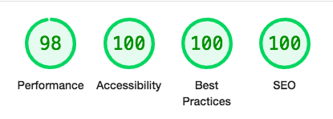

**Home Page - Mobile:**

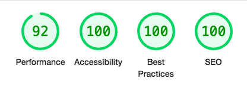

I was very pleased with my lighthouse results for the home page on both desktop and mobile.

**Quiz Page - Desktop:**

After my initial lighthouse testing for the quiz page I wanted to improve accessibiity to achieve a top score of 100 and found the following issue:

By ammending the h3 heading in the footer to a h2 element in the quiz page, so that the heading elements were all in a sequentially descending order, this resolved the issue. See final lighthouse below:

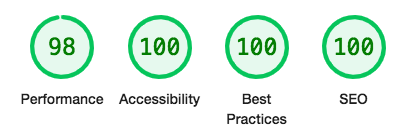

**Quiz Page - Mobile:**

I was happy with the mobile lighthouse results for the quiz page. There was definitely room for improvement with performance, but as this was in the green, I felt that I could revisit this another time.

**Map Page:**

  
Overall I was happy with the lighthouse results for the Maps page. Best practices could have been better, as detailed below. However, I was unable to find a solution to rectifing the marker resolution. Perhaps I will revisit this at a later stage in my developent.

## Full manual testing

I performed rigorous manual testing on all pages to make sure all internal, external links, quiz functionality and, Google maps worked as expected.

**Home Page:**

Expected result | Testing | Pass/Fail
---|---|---
Header navigation links to direct user to other pages (including mobile dropdown navigation) | Clicked through each nav link | Pass
Footer Intagram icon takes user to external webpage | Clicked instagram icon | Pass
'Start Quiz' button redirects user to quiz.html viewing mutliple choice questions| Clicked on buttons | Pass

**Quiz Page:**

Expected result | Testing | Pass/Fail
---|---|---
Header navigation links to direct user to other pages (including mobile dropdown navigation) | Clicked through each nav link | Pass
Footer Intagram icon takes user to external webpage | Clicked instagram icon | Pass
Allow only one radio button selection at a time | Clicked through radio buttons, highlighting each selection | Pass
Next button directs user to next question when clicked | Clicked through next button every time a radio button was selected until submit button was reached | Pass
If a radio button isn't selected and the user attemps to click next, an alert pops up alerting the user to select an answer | Clicked through each question as if no radio button was selected | Pass
When a user lands on the final question the next button is replaced with a submit button | Clicked through each quetion before arriving at the final one, displaying a submit button instead | Pass
On submission, 1 of 11 results are displayed as an individual card with the following included: A heading, description, photograph and external link | Submitted the quiz 11 times, making sure to generate all possible score outcomes to view all possible results produced | Pass
Within the results card the 'more info' link takes a user to an external website with more infomation on specific result | Clicked on each link from 11 generated results | Pass
Once a user reaches the results card, below this they can redirect to maps.html by clicking the map icon | Clicked on map icon | Pass
Oncer a user reaches the results card, below this they can click on the 'Start over' button to restart the quiz | Clicked on 'Start over' button to take user back to first quiz question | Pass

**Maps Page:**

Expected result | Testing | Pass/Fail
---|---|---
Header navigation links to direct user to other pages (including mobile dropdown navigation) | Clicked through each nav link | Pass
Footer Intagram icon takes user to external webpage | Clicked instagram icon | Pass
Google maps loads showing 11 markers on the screen over South Wales | Clicked on maps page and viewed content | Pass
Google Map functions such as zoom in/out and move around page functioning as expected | Clicked on zoom in/out button and dragged screen around to explore maps | Pass
When clicked on, Google markers display place name | Clicked on each 11 markers to display place name | Pass
When Google markers are double clicked, this takes a user to an external webpage, displaying more information on the location | Double clicked on each marker to open external web page | Pass

**404 Error Page:**

Expected result | Testing | Pass/Fail
---|---|---
Header navigation links to direct user to other pages (including mobile dropdown navigation) | Clicked through each nav link | Pass
Footer Intagram icon takes user to external webpage | Clicked instagram icon | Pass
The 404 webpage is displayed when the URL subdirectory is inputted incorrectly | Modified subdiretory of URL to something nonexistent to display 404 error | Pass
'Return home' button takes user back to home page of website | Clicked on 'home page' button and was redicted to home page | Pass
